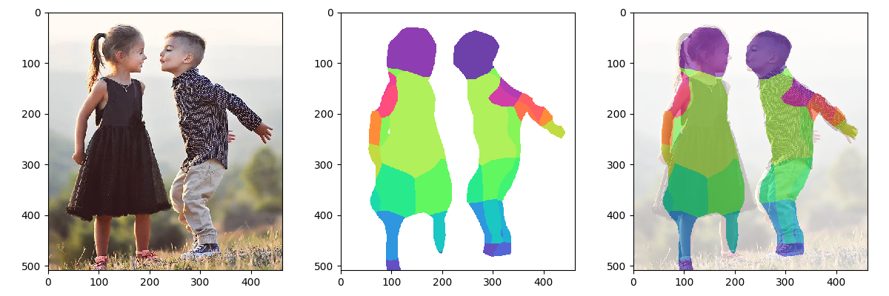

# BodyPix on Node.js
Segmented by BodyPix 2.0 and visualized by Python.


## Usage

### Directory tree
```
├── demo                # `root_dir` 
│   ├── mask.mp4   # step 4 output
│   ├── demo.mp4        # origin input
│   ├── jpgs            # step 1 output
│   ├── jsons           # stpe 2 output
│   └── masked_jpgs     # step 3 output
```

### Requirements
- ffmpeg
- Python3 
- opencv Python
- node.js

### Running: 5 steps
- step 0
Make a directory as `root_dir`, and put a .mp4 file to your `root_dir`. 
The .mp4 file name must be the same as your `root_dir`, e.g. a `demo.mp4` in `demo` directory.

run local BodyPix models file server:
```
cd models && python3 -m http.server
```

**steps 1-4**
- step 1
```
python3 1_mp4_to_jpgs.py `root_dir`
```

- step 2
```
node main.js `root_dir`
```

- step 3
```
python3 utils/visualize_masked_image.py `root_dir`
```

- step 4
```
python3 4_jpgs_to_mp4.py `root_dir`
```

Or **All in on steps 1-4**
```
python3 all_in_one.py `root_dir`
```
logs on CPU:
```
python3 all_in_one.py /demo_bodypix/demo1
run: python3 1_mp4_to_jpgs.py /demo_bodypix/demo1
Elapsed time: 0.88
run: node src/main.js /demo_bodypix/demo1
Elapsed time: 106.41
run: python3 utils/visualize_masked_image.py /demo_bodypix/demo1
Elapsed time: 123.97
run: python3 4_jpgs_to_mp4.py /demo_bodypix/demo1
Elapsed time: 1.19
```

## 坑
- tfjs-node与node.js配合就是个坑，比如:https://github.com/tensorflow/tfjs/issues/2003